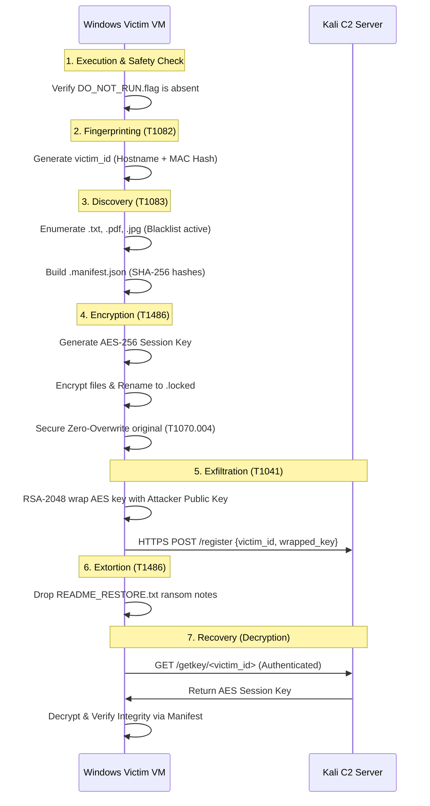

# 🛡️ Ransomware Simulator: Educational Kill-Chain Analysis

[](docs/phase3/)
[](https://www.tbs.rnu.tn/)
[](#-safety-declaration)

A sophisticated, academic-grade ransomware simulator developed for the **IT360 Security Project** at **Tunis Business School**. This project demonstrates a complete hybrid-encryption kill chain, mapping simulated adversary behavior to the **MITRE ATT&CK®** framework.

---

## ⚠️ Safety Declaration

> [!CAUTION]
> **STRICTLY EDUCATIONAL USE ONLY**
> This repository contains functional code that simulates ransomware behavior. It is designed for controlled academic research and must be handled with extreme care.

- **NO EXTERNAL DEPLOYMENT:** Never run this code outside an isolated, host-only Virtual Machine (VM).
- **KILL-SWITCH:** The simulator respects a `DO_NOT_RUN.flag` file. If present, all execution halts immediately.
- **SAFE TARGETING:** The engine explicitly blacklists system-critical extensions (`.exe`, `.dll`, `.sys`) to prevent OS bricking.
- **ISOLATED NETWORK:** All C2 communication occurs over a non-routed Host-Only network.

---

## 🏗️ Architecture & Functional Flow

The simulator replicates a modern ransomware operation across two isolated nodes: a **Windows 10 Victim VM** and a **Kali Linux Attacker VM**.

### The Kill-Chain Process



---

## 🛡️ MITRE ATT&CK® Mapping

The simulator implements 10 specific techniques across 7 tactics, providing a comprehensive "live" dataset for security monitoring and detection engineering.

| Tactic | Technique ID | Technique Name | Implementation |
| :--- | :--- | :--- | :--- |
| **Execution** | T1059.006 | Python Scripting | Core logic orchestrated via Python 3.11 |
| **Discovery** | T1083 | File Discovery | Recursive `os.walk` with extension filtering |
| **Collection** | T1005 | Local Data Access | Reading file content for encryption/hashing |
| **Impact** | T1486 | Data Encrypted | AES-256-CBC bulk file encryption |
| **Exfiltration** | T1041 | C2 Exfiltration | HTTPS POST of RSA-wrapped session keys |
| **Evasion** | T1070.004 | File Deletion | Multi-step zero-overwrite of original files |
| **C2** | T1071.001 | Web Protocols | Flask-based HTTPS Command & Control |

> [!TIP]
> See the full [MITRE Final Mapping](docs/phase3/mitre_final_mapping.md) for detailed detection opportunities and blue-team countermeasures.

---

## 🛠️ Technical Stack

- **Core Logic:** Python 3.11 (interpreted for auditability)
- **Encryption:** `cryptography` library (AES-256-CBC, RSA-2048 OAEP)
- **C2 Server:** Flask (Python) with TLS/HTTPS support
- **Data Integrity:** SHA-256 Hashing (Pre/Post-encryption verification)
- **Environment:** VirtualBox (Windows 10 Pro / Kali Linux 2024)

---

## 📂 Project Structure

```text
├── src/
│   ├── dropper/        # Main orchestrator & safety logic
│   ├── encryptor/      # AES engine & Decryption recovery
│   ├── c2_server/      # Flask API & RSA Key Store
│   └── common/         # Shared configs (RSA Public Key, Target Exts)
├── docs/               # Phase 1-3 Documentation
│   ├── phase1/         # Concepts & Threat Modeling
│   ├── phase2/         # HLD & Component Specs
│   └── phase3/         # Final Flow & Test Reports
├── vm-setup/           # Configuration for isolated testing
├── main.py             # Entry point
└── requirements.txt    # Dependency list
```

---

## 👥 The Team

| Member | Role | Contribution |
| :--- | :--- | :--- |
| **Rooya Jelassi** | P1 — Malware Developer (Lead Programmer) | Encryption/decryption engine |
| **Oussama Zmitri** | P2 — C2 & Network Engineer | Key server, exfiltration channel |
| **Mohamed Aziz Fekih**| P3 — Systems Architect | Repository Management, CI/CD, Common Config |
| **Ghayth Hajji** | P4 — Threat Intelligence Analyst | Research, MITRE ATT&CK mapping,SotA |
| **Noutayla Nefzaoui** | P5 — VM & Testing Lead | Environment Hardening, Snapshot Policy, QA |

---

## 🚀 Setup & Execution

### 1. Prerequisites
- Python 3.11+
- `pip install -r requirements.txt`
- Isolated VM environment (Recommended: VirtualBox)

### 2. C2 Server Setup (Attacker VM)
```bash
# Generate certs if missing
# Run the Flask server
python src/c2_server/server.py
```

### 3. Simulator Execution (Victim VM)
```powershell
# Ensure DO_NOT_RUN.flag is NOT in C:\
python main.py
```

---

## 📜 License & Disclaimer

This project is licensed under the MIT License - see the LICENSE file for details.  
**Disclaimer:** This tool is for educational purposes only. The authors are not responsible for any misuse or damage caused by this software. Use responsibly in authorized environments only.