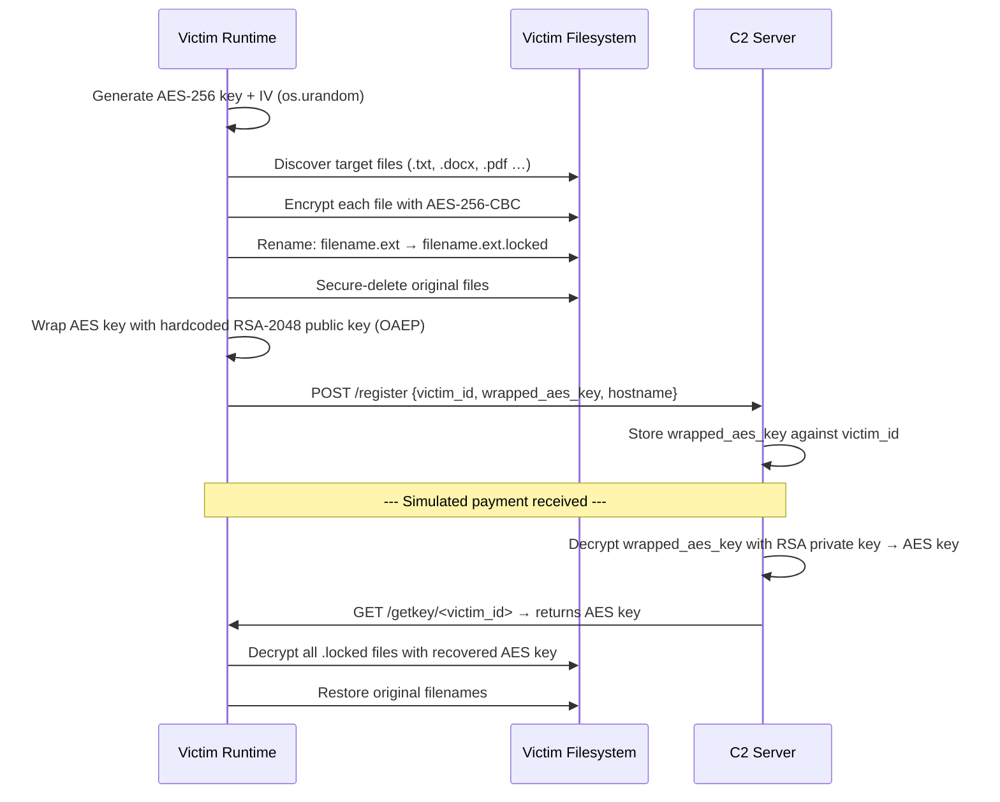

# Cryptographic Rationale for the Ransomware Simulator
**IT360 — Project 14 | P1: Malware Developer**

---

## 1. The Core Problem: Why One Algorithm Is Never Enough

A naive ransomware design might encrypt every file with a single RSA key pair.
This fails in practice for a fundamental reason: RSA (and asymmetric
cryptography in general) is computationally expensive. Encrypting a 1 GB file
with RSA-2048 is not feasible in real time — it is designed to encrypt small
payloads (hundreds of bytes), not bulk data.

Conversely, encrypting all files with a single AES key and storing that key
anywhere on the victim machine defeats the purpose: a defender or forensic
analyst could extract the key from memory or disk and recover all files without
paying.

The solution used by every serious ransomware family since CryptoLocker (2013)
is **hybrid encryption**: two algorithms working together, each doing what it
is best at.

---

## 2. AES-256 for File Content Encryption

**Algorithm:** AES (Advanced Encryption Standard), 256-bit key.

AES is a symmetric block cipher, meaning the same key is used for encryption
and decryption. It operates on fixed 128-bit blocks of plaintext.

**Why AES for files?**

| Property | Detail |
|---|---|
| Speed | AES-NI (hardware acceleration) achieves multi-GB/s throughput on modern CPUs |
| Security | AES-256 provides 256 bits of key space — brute force is computationally infeasible |
| Standardization | NIST-approved, FIPS 140-2 compliant — universally trusted |
| Bulk suitability | Designed for encrypting arbitrarily large data streams |

A fresh, random AES-256 key (32 bytes) and IV (16 bytes) are generated per
execution using a cryptographically secure random number generator
(`os.urandom()`). This session key exists in memory only long enough to
encrypt files and transmit the key to the C2 server.

### CBC vs. CTR Mode

| Mode | IV/Nonce | Parallelizable | IV Reuse Consequence |
|---|---|---|---|
| CBC (Cipher Block Chaining) | 16-byte IV, unique per message | Decryption only | Partial plaintext leak in first block |
| CTR (Counter) | 16-byte nonce, unique per message | Both directions | **Catastrophic** — nonce reuse leaks plaintext XOR directly |

**This simulator uses AES-CBC** for its simplicity in the PoC stage and
well-understood padding behavior. A production-grade implementation would
prefer AES-CTR or AES-GCM (which also provides authentication). CTR's
parallelizability makes it faster for large files, which is why LockBit 3.0
uses a variant of CTR for its high-speed encryption routine.

**Critical implementation note:** The IV must be generated fresh with
`os.urandom(16)` for every encryption operation. A hardcoded or reused IV
breaks confidentiality. The IV is not secret — it is prepended to the
ciphertext — but it must be unique.

---

## 3. RSA-2048 for AES Key Wrapping

**Algorithm:** RSA (Rivest–Shamir–Adleman), 2048-bit key pair.

RSA is an asymmetric algorithm: data encrypted with the **public key** can
only be decrypted with the corresponding **private key**.

**Why RSA for the AES key?**

The AES session key is only 32 bytes — small enough for RSA to encrypt
efficiently. The result of encrypting these 32 bytes with the attacker's
RSA-2048 public key is a 256-byte ciphertext blob. This blob is what gets
transmitted to the C2 server.

**The trust model this creates:**
Even if a defender intercepts the network traffic and captures the POST
request to the C2, they see only the RSA-wrapped AES key — a 256-byte blob
that is unrecoverable without the attacker's private key. This is why law
enforcement takedowns focus on seizing C2 infrastructure: the 2021 REvil
takedown recovered decryption keys only because agents gained access to the
group's private key server.

### Padding Scheme: RSA-OAEP over PKCS#1 v1.5

This simulator uses **RSA-OAEP with SHA-256** for key wrapping.
PKCS#1 v1.5 padding, while still common in legacy systems, is vulnerable
to Bleichenbacher's padding oracle attack (1998) — an adaptive chosen-ciphertext
attack that allows an attacker to recover plaintext through repeated
decryption oracle queries. OAEP (Optimal Asymmetric Encryption Padding)
was specifically designed to close this vulnerability.

**Key size justification:** RSA-2048 provides approximately 112 bits of
equivalent symmetric security and is NIST-recommended for use through 2030.
For a forward-looking implementation, ECC (Curve25519 / X25519) offers
equivalent security with a 256-bit key, is faster, and produces smaller
ciphertexts — reasons why modern ransomware families like BlackCat/ALPHV
have moved toward ECC-based key exchange.

---

## 4. Key Lifecycle — Sequence Diagram

---

## 5. Detection Implications

| Defender Observation | Mapped Behaviour |
|---|---|
| High-volume file rename events with `.locked` extension | AES encryption loop (T1486) |
| Anomalous HTTPS POST to unknown external IP | AES key exfiltration to C2 (T1041) |
| Spike in disk read/write I/O over short window | File discovery + encryption pass (T1083) |
| Process reading large numbers of files by extension | `os.walk()` targeting (T1005) |

A defender cannot recover the AES key from memory alone once it has been
transmitted to the C2 and the victim process has exited. The only recovery
paths are: (1) C2 server cooperation, (2) law enforcement seizure of C2
infrastructure and private key material, or (3) a flaw in the ransomware's
key generation or IV reuse — the most common cryptographic mistake in
real-world amateur ransomware implementations.

---
