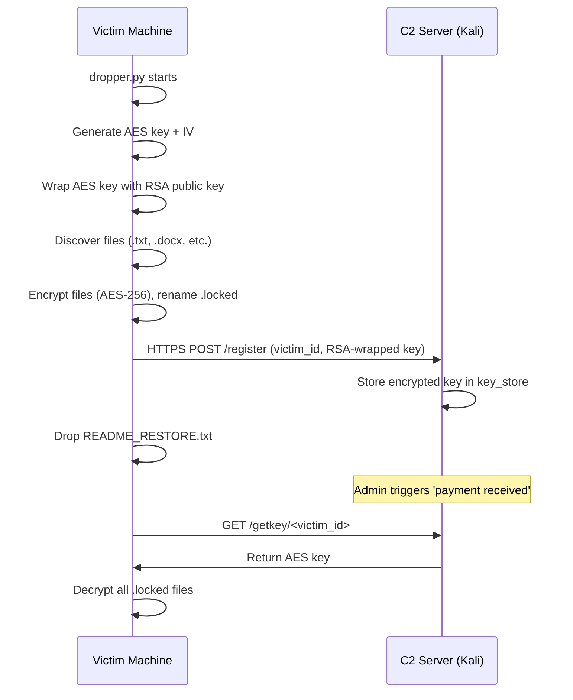

# Functional Flow — Ransomware Simulator Kill Chain

## Overview

This document describes the complete execution flow of the ransomware simulator,
from dropper launch to file decryption.

## Stage 1: Dropper Execution

The attacker places dropper.py on the victim machine.
When executed, it starts the entire kill chain.
Safety check: if file C:\DO_NOT_RUN.flag exists, the dropper exits immediately.

## Stage 2: Key Generation

A random 256-bit AES session key and 128-bit IV are generated.
The AES key is wrapped (encrypted) with the attacker's RSA-2048 public key.

## Stage 3: File Discovery

os.walk() scans the target directory for files with extensions:
.txt, .docx, .pdf, .jpg, .png, .xlsx
Files with .exe, .dll, .sys are skipped.

## Stage 4: Encryption Loop

Each discovered file is encrypted with AES-256.
File is renamed with .locked extension.
A SHA-256 hash manifest (.manifest.json) is written.

## Stage 5: Key Exfiltration

An HTTPS POST request is sent to the C2 server with:
- victim_id (hash of hostname + MAC address)
- RSA-wrapped AES key

## Stage 6: Ransom Note Drop

README_RESTORE.txt is written in every encrypted directory.

## Stage 7: Decryption

Admin triggers payment on C2 (/release/<victim_id>).
Decryptor fetches AES key from C2 and restores all files.

## Sequence Diagram

