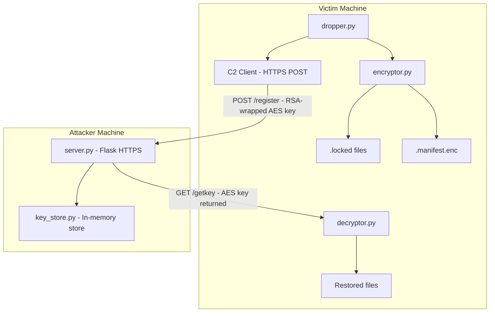
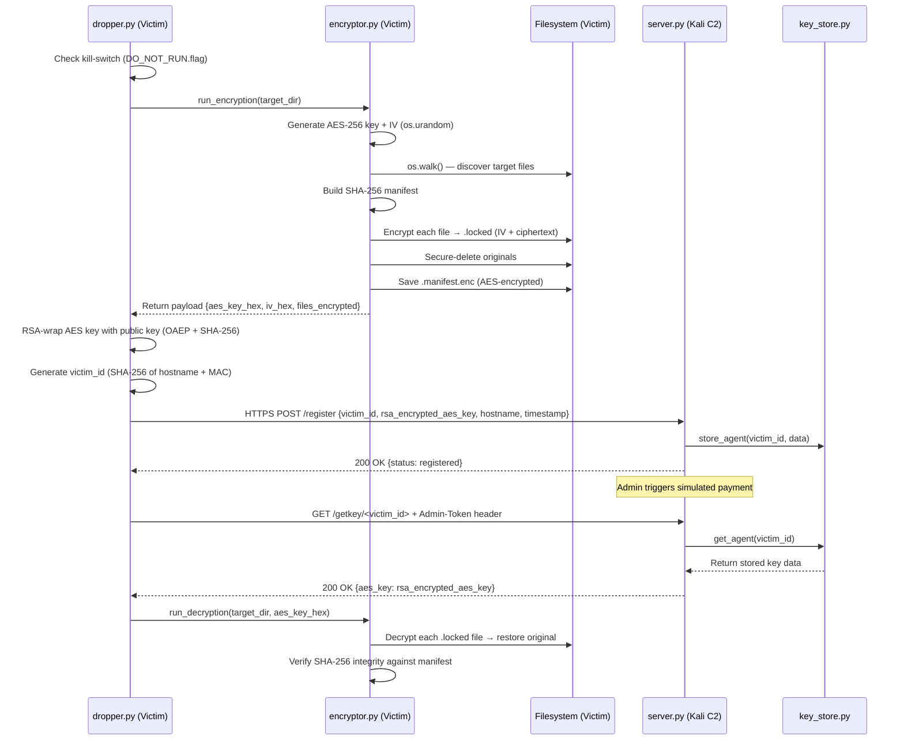
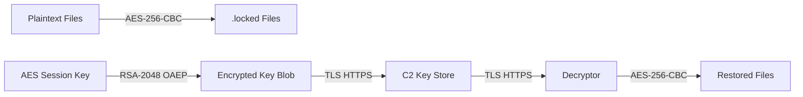

# High-Level Design — Ransomware Simulator
**IT360 Project 14 | Phase 2**

---

## 1. Architecture Overview

The simulator consists of two machines connected over a Host-Only network:
- **Victim Machine (Windows 10)** — runs the dropper, encryptor, and decryptor
- **Attacker Machine (Kali Linux)** — runs the C2 server and key store

---

## 2. Component Table

| Component | Purpose | Language / Framework | Inputs | Outputs | Interfaces |
|---|---|---|---|---|---|
| `dropper.py` | Orchestrates the full kill chain | Python 3.11 | `config.py` constants, RSA public key | RSA-wrapped AES key, C2 registration | Calls `encryptor.py`, calls C2 `/register` |
| `encryptor.py` | Encrypts target files with AES-256-CBC | Python 3.11 + `cryptography` | Target directory, AES key + IV | `.locked` files, `.manifest.enc`, payload dict | Called by `dropper.py` |
| `decryptor.py` | Restores encrypted files after key recovery | Python 3.11 + `cryptography` | AES key hex (from C2), `.locked` files | Restored plaintext files | Called by `dropper.py` or standalone |
| `server.py` | C2 server — receives and serves keys | Python 3.11 + Flask + HTTPS | POST `/register` payload, GET `/getkey` request | JSON responses, stored key data | Exposes REST API over HTTPS port 5000 |
| `key_store.py` | In-memory store for victim key data | Python 3.11 | `store_agent()`, `get_agent()` calls | Victim key records | Called by `server.py` |
| `config.py` | Shared constants — single source of truth | Python 3.11 | N/A | C2 URL, extensions, RSA public key, kill-switch path | Imported by all modules |

---

## 3. Data Flow & Message Exchange

---

## 4. Security Boundaries

| Stage | Data in Transit | Encryption State | Notes |
|---|---|---|---|
| File encryption | Plaintext → `.locked` | AES-256-CBC | IV prepended to ciphertext, original securely deleted |
| Manifest storage | File hashes → `.manifest.enc` | AES-256-CBC | Same session key, IV prepended |
| AES key in memory | Raw bytes | Unencrypted | Exists in memory only during execution |
| AES key to C2 | `rsa_encrypted_aes_key` field | RSA-2048 OAEP | Intercepting this packet reveals nothing without private key |
| C2 transport layer | Full HTTP payload | TLS (self-signed cert) | HTTPS on port 5000, cert in `src/c2_server/certs/` |
| Key at rest on C2 | Stored in `key_store.py` | RSA-encrypted | Private key never leaves the C2 server |
| Key returned to victim | `aes_key` in response | TLS only | Returned as RSA-encrypted blob, dropper decrypts with private key |

### Security Boundary Diagram

