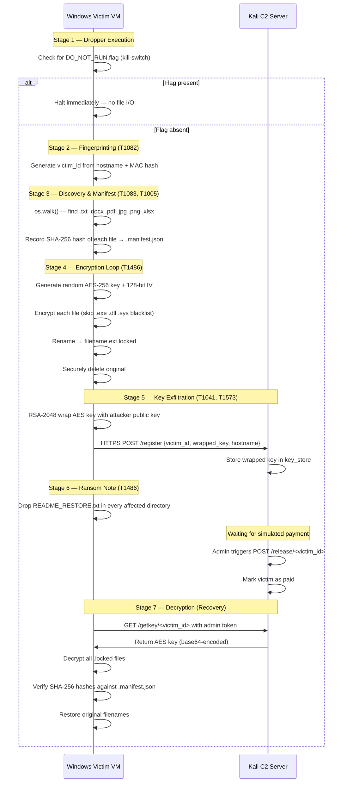

# IT360 Phase 3: Functional Flow Documentation


---

## 1. Overview

The simulator replicates a hybrid-encryption ransomware kill chain across two isolated virtual machines. The Victim VM (Windows 10) runs the dropper, encryptor, and decryptor. The Attacker VM (Kali Linux) hosts the Flask C2 server and key store. All communication is over a Host-Only network with no internet route.

**Seven stages are executed in sequence:**

1. Dropper Execution & Safety Check
2. System Fingerprinting
3. File Discovery & Manifest Creation
4. AES-256 Encryption Loop
5. Key Wrapping & C2 Exfiltration
6. Ransom Note Deployment
7. Decryption on Key Receipt

---

## 2. Component Map

| Component | File | VM | Owner |
| :--- | :--- | :--- | :--- |
| Dropper (orchestrator) | `src/dropper/dropper.py` | Windows Victim | P1 |
| Encryptor | `src/encryptor/encryptor.py` | Windows Victim | P1 |
| Decryptor | `src/encryptor/decryptor.py` | Windows Victim | P1 |
| C2 Server | `src/c2_server/server.py` | Kali Attacker | P2 |
| Key Store | `src/c2_server/key_store.py` | Kali Attacker | P2 |
| Shared Config | `src/common/config.py` | Both | P3 |

---

## 3. Full Kill-Chain Flow Diagram



---

## 4. Stage-by-Stage Detail

### Stage 1 — Dropper Execution & Kill-Switch Check

**File:** `src/dropper/dropper.py`  
**MITRE:** *(Safety control — no ATT&CK mapping; mirrors WannaCry kill-switch domain concept)*

The dropper is the orchestrator. Its first action is to check for the existence of `C:\DO_NOT_RUN.flag` (Windows) or `/tmp/DO_NOT_RUN.flag` (Linux). If the flag file is present, the dropper prints a halt message and exits immediately with no file system modifications. This is both a responsible academic safeguard and a deliberate parallel to the WannaCry kill-switch domain (`iuqerfsodp9ifjaposdfjhgosurijfaewrwergwea.com`) — documented in `README.md`.

---

### Stage 2 — System Fingerprinting

**File:** `src/dropper/dropper.py`  
**MITRE:** T1082 — System Information Discovery

The dropper generates a deterministic `victim_id` by hashing the machine's hostname and MAC address with SHA-256 (truncated to 16 hex characters). This uniquely identifies the victim across C2 interactions without storing personally identifiable information — consistent with the approach used by professional ransomware families.

---

### Stage 3 — File Discovery & Manifest Creation

**File:** `src/dropper/dropper.py` → calls `src/encryptor/encryptor.py`  
**MITRE:** T1083 — File and Directory Discovery | T1005 — Data from Local System

`os.walk()` traverses the target directory recursively. Files matching the target extensions defined in `config.py` (`.txt`, `.docx`, `.pdf`, `.jpg`, `.png`, `.xlsx`) are queued for encryption. Files matching the blacklist (`.exe`, `.dll`, `.sys`) are skipped and logged.

Before encryption begins, the encryptor writes a hidden `.manifest.json` file recording the original filename and SHA-256 hash of every file. This manifest is used by the decryptor to verify integrity post-restoration.

**Target extensions** (from `config.py`):
```python
TARGET_EXTENSIONS = ['.txt', '.docx', '.pdf', '.jpg', '.png', '.xlsx']
BLACKLIST_EXTENSIONS = ['.exe', '.dll', '.sys']
```

---

### Stage 4 — AES-256 Encryption Loop

**File:** `src/encryptor/encryptor.py`  
**MITRE:** T1486 — Data Encrypted for Impact

A single AES-256 session key and 128-bit IV are generated randomly per dropper execution using the `cryptography` library (`os.urandom(32)` for key, `os.urandom(16)` for IV). Each file is encrypted in AES-CBC mode. The encrypted content is written to `filename.ext.locked` and the original file is securely overwritten and deleted (T1070.004).

**Why AES for file content:** AES-256 is symmetric and fast — suitable for bulk file encryption. Using a unique key per session means even if one session's key is compromised, other victims' files remain protected.

---

### Stage 5 — Key Wrapping & C2 Exfiltration

**Files:** `src/dropper/dropper.py`, `src/c2_server/server.py`  
**MITRE:** T1041 — Exfiltration Over C2 Channel | T1573 — Encrypted Channel

The AES session key is encrypted (wrapped) with the attacker's RSA-2048 public key (stored as a PEM string in `config.py`). This means:
- The AES key is never transmitted in plaintext.
- Even if the HTTPS traffic is intercepted, the wrapped key cannot be decrypted without the attacker's RSA private key (held only on the C2 server).

The wrapped key is sent via `HTTPS POST /register` with payload:
```json
{
  "victim_id": "35d347e978c3ba0a",
  "hostname": "WindowsVictim",
  "wrapped_key": "<256-byte RSA ciphertext, base64-encoded>",
  "timestamp": "2026-04-30T..."
}
```
The C2 server stores the wrapped key in `key_store.py` indexed by `victim_id`.

**Why HTTPS:** TLS encryption prevents deep packet inspection (DPI) from extracting payload content, consistent with real-world C2 evasion techniques.

---

### Stage 6 — Ransom Note Deployment

**File:** `src/dropper/dropper.py`  
**MITRE:** T1486 — Data Encrypted for Impact

After encryption completes, the dropper drops a `README_RESTORE.txt` file in every directory that contained encrypted files. The note includes the `victim_id`, simulated payment instructions, and a simulated contact address. It contains an academic disclaimer confirming this is a university simulator.

---

### Stage 7 — Decryption on Key Receipt

**File:** `src/encryptor/decryptor.py`  
**MITRE:** *(Recovery phase — inverse of T1486)*

After simulated payment, the C2 admin triggers `POST /release/<victim_id>`, which marks the victim as paid. The decryptor calls `GET /getkey/<victim_id>` (authenticated with an admin token) to retrieve the AES key. It then:

1. Loads `.manifest.json` to retrieve the list of encrypted files and their original hashes.
2. Decrypts each `.locked` file using the retrieved AES key and IV.
3. Restores the original filename.
4. Recomputes the SHA-256 hash and compares against the manifest — any mismatch is flagged as a failure.

---

## 5. MITRE ATT&CK Technique Mapping Summary

| Stage | Technique ID | Technique Name | Implementation |
| :--- | :--- | :--- | :--- |
| Dropper Execution | T1059.006 | Command & Scripting: Python | Dropper is a Python script |
| Fingerprinting | T1082 | System Information Discovery | Hostname + MAC → victim_id |
| File Discovery | T1083 | File and Directory Discovery | `os.walk()` with extension filter |
| Data Collection | T1005 | Data from Local System | File content read before encryption |
| Encryption | T1486 | Data Encrypted for Impact | AES-256-CBC loop |
| File Cleanup | T1070.004 | File Deletion | Original files overwritten and deleted |
| Key Transport | T1041 | Exfiltration Over C2 Channel | HTTPS POST of RSA-wrapped AES key |
| Encrypted Channel | T1573 | Encrypted Channel | TLS (self-signed cert) + RSA key wrap |
| C2 Protocol | T1071.001 | Web Protocols | Flask HTTPS server |
| Persistence | T1547.001 | Registry Run Keys | *Documented for awareness; not implemented* |

> Full ATT&CK Navigator layer file: `docs/phase3/attack_layer.json` (P4)

---

## 6. Safety Controls Summary

| Control | Implementation | Reference |
| :--- | :--- | :--- |
| Kill-switch flag | `DO_NOT_RUN.flag` check at dropper entry | WannaCry kill-switch analogy — `README.md` |
| Executable blacklist | `.exe`, `.dll`, `.sys` never targeted | `config.py` — `BLACKLIST_EXTENSIONS` |
| Host-Only network | No internet route on Victim VM | `vm-setup/vm_config.md` |
| Snapshot restore | `PRE_TEST_PHASE3` restored after every test run | `vm-setup/snapshot_policy.md` |
| Air-gapped execution | No NAT, no bridged adapter, clipboard disabled | `vm-setup/vm_config.md` |

---

